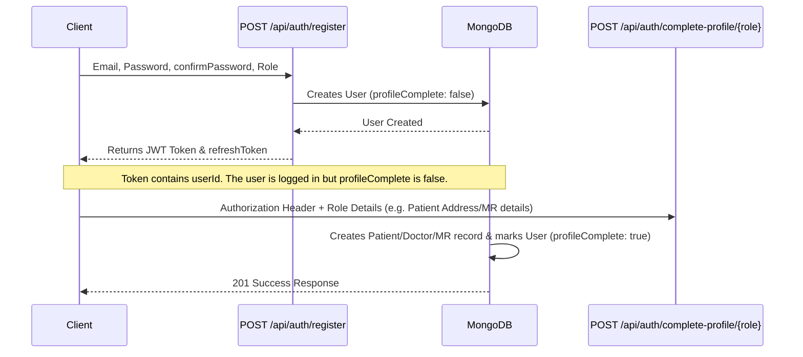
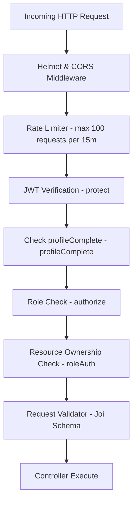
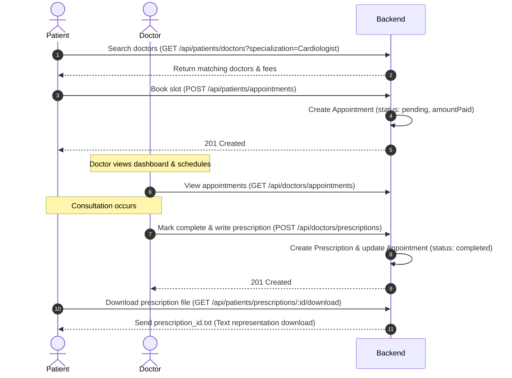
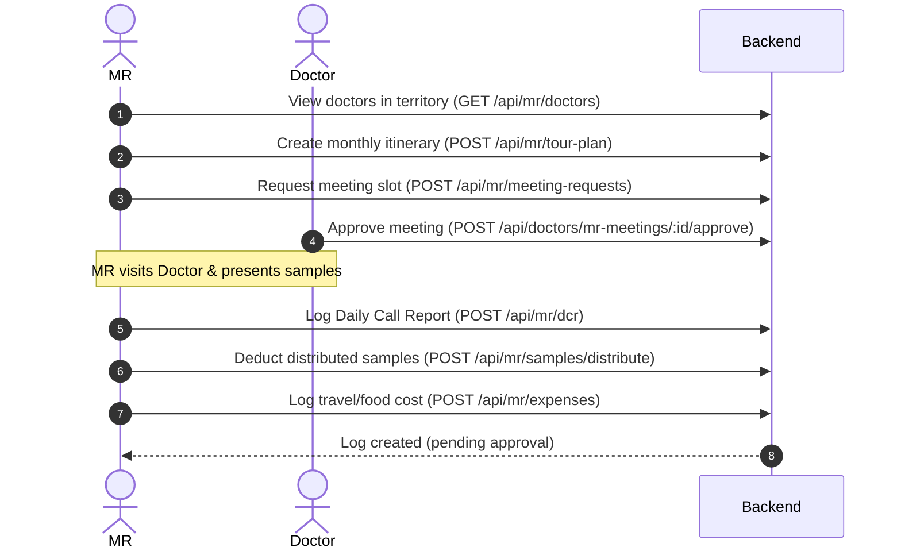

# Medionic (HealthCare+) Backend System Documentation

Welcome to the comprehensive backend documentation for the **HealthCare+ (Medionic)** platform. This system is a production-ready, feature-rich Node.js, Express, and MongoDB-based healthcare management backend supporting three key ecosystem roles: **Patients**, **Doctors**, and **Medical Representatives (MR)**.

This document covers the entire system architecture, directory structures, complete database schemas, the two authentication flows, detailed API specifications for all **75 endpoints**, security controls, and step-by-step business workflows.

---

## 1. System Architecture & Directory Structure

The system is designed using the **Model-View-Controller (MVC)** architectural pattern. Express handles routing and HTTP requests, Mongoose interacts with MongoDB, and Joi schemas validate request payloads.

```
medionic_apis/
├── config/
│   └── constants.js             # Globals, Enums, JWT config, file rules
├── controllers/
│   ├── authController.js        # Generic Auth & Profile Completion logic
│   ├── patientController.js     # Patient Core logic
│   ├── patientExtendedController.js # Patient Extended logic
│   ├── doctorController.js      # Doctor Core logic
│   ├── doctorExtendedController.js # Doctor Extended logic
│   ├── mrController.js          # MR Core logic
│   ├── mrExtendedController.js  # MR Extended logic
│   └── auth/                    # Role-specific signup/login controllers
│       ├── doctor/doctorController.js
│       ├── mr/mrController.js
│       └── patient/patientController.js
├── middleware/
│   ├── auth.js                  # JWT verification & role authorization
│   ├── roleAuth.js              # Resource-level permission checkers
│   ├── validation.js            # Request payload Joi validators
│   └── errorHandler.js          # Centralized Express error handler
├── models/
│   ├── User.js                  # Auth credentials & status
│   ├── Patient.js               # Patient demographics & history
│   ├── Doctor.js                # Doctor qualifications & clinic info
│   ├── MedicalRep.js            # MR info, territory & samples inventory
│   ├── Appointment.js           # Patient-Doctor bookings
│   ├── Prescription.js          # Medicines, tests & follow-up info
│   ├── PharmacyOrder.js         # Pharmacy items ordered by Patients
│   ├── HealthMetric.js          # Health tracker logs (BP, HR, Weight, etc.)
│   └── MRMeetings.js            # MR-Doctor meeting schedules
├── routes/
│   ├── authRoutes.js            # Generic authentication routes
│   ├── patientRoutes.js         # Patient endpoints
│   ├── doctorRoutes.js          # Doctor endpoints
│   ├── mrRoutes.js              # MR endpoints
│   └── auth/                    # Role-specific signup/login routes
│       ├── doctor/doctorRoutes.js
│       ├── mr/mrRoutes.js
│       └── patient/patientRoutes.js
├── uploads/                     # Local storage for Gov IDs, Degrees, Pictures
├── server.js                    # Express app instantiation & DB connector
└── postman_collection.json      # Pre-configured collection of 75 API requests
```

---

## 2. Database Schema & Data Models

All models are built with **Mongoose** schemas and contain auto-generated `createdAt` and `updatedAt` timestamps.

### 2.1 User Schema (`User.js`)
Serves as the root credential document for authentication.
* **Fields**:
  * `email` (String, Required, Unique, Lowercase, Trimmed): Validated email regex.
  * `password` (String, Required, Min length 6): Hashed using `bcryptjs` (salt: 10 rounds).
  * `role` (String, Enum: `['patient', 'doctor', 'mr', 'admin']`, Default: `'patient'`).
  * `status` (String, Enum: `['active', 'inactive', 'suspended']`, Default: `'active'`).
  * `profileComplete` (Boolean, Default: `false`): Set to `true` after completing the role profile.
  * `resetPasswordToken` / `resetPasswordExpire` (String / Date): Used for password resets.
  * `emailVerified` (Boolean, Default: `false`).
  * `lastLogin` (Date, Default: `Date.now`).
* **Indexes**: `{ role: 1 }`, `{ status: 1 }`, `{ createdAt: -1 }`.

### 2.2 Patient Schema (`Patient.js`)
Demographics and history linked 1-to-1 to a User document.
* **Fields**:
  * `userId` (ObjectId -> User, Unique, Required).
  * `firstName` / `lastName` (String, Required, Trimmed).
  * `dob` (Date, Required).
  * `gender` (String, Enum: `['male', 'female', 'other', 'prefer-not-to-say']`, Required).
  * `address` (Subdocument, Required): `{ street, city, state, zip }`.
  * `bloodGroup` (String, Enum: `['A+', 'A-', 'B+', 'B-', 'AB+', 'AB-', 'O+', 'O-', 'unknown']`, Default: `'unknown'`).
  * `emergencyContact` (Subdocument, Required): `{ name, phone, relation }`.
  * `medicalHistory` (Array): List of `{ condition, diagnosisDate, status ('active', 'resolved', 'chronic'), notes }`.
  * `allergies` (Array): List of `{ allergen, severity ('mild', 'moderate', 'severe'), reaction }`.
* **Virtuals**: `fullName` (returns `firstName + ' ' + lastName`).

### 2.3 Doctor Schema (`Doctor.js`)
Professional details and verification statuses of registered doctors.
* **Fields**:
  * `userId` (ObjectId -> User, Unique, Required).
  * `firstName` / `lastName` (String, Required).
  * `specialization` (String, Required).
  * `licenseNumber` (String, Required, Unique, Trimmed).
  * `registrationCouncil` (String, Required).
  * `qualification` (String, Required).
  * `yearsExperience` (Number, Required).
  * `clinic` (Subdocument, Required): `{ name, address, city, phone }`.
  * `consultationFee` (Number, Default: `500`).
  * `verificationStatus` (String, Enum: `['pending', 'verified', 'rejected']`, Default: `'pending'`).
  * `profilePicture` (String): Path to local profile picture file.
  * `bio` (String).
  * `verificationDocuments` (Array): List of `{ documentType (govId, degree, councilId), documentUrl, uploadedAt }`.
* **Virtuals**: `fullName` (returns `firstName + ' ' + lastName`).

### 2.4 Medical Representative Schema (`MedicalRep.js`)
Represents the Medical Representatives (MR) working in territories.
* **Fields**:
  * `userId` (ObjectId -> User, Unique, Required).
  * `firstName` / `lastName` (String, Required).
  * `phone` (String, Required).
  * `employmentDetails` (Subdocument, Required): `{ companyName, employeeId, designation }`.
  * `territory` (String, Required): Matches the doctor's clinic city for route validation.
  * `verificationStatus` (String, Enum: `['pending', 'verified', 'rejected']`, Default: `'pending'`).
  * `profilePicture` (String).
  * `verificationDocuments` (Array): List of `{ documentType (companyId, govId, authLetter), documentUrl, uploadedAt }`.
  * `samplesInventory` (Array): List of `{ sampleName, batchNumber, quantity, expiryDate }`.

### 2.5 Appointment Schema (`Appointment.js`)
Stores doctor-patient consult slots.
* **Fields**:
  * `patientId` (ObjectId -> User, Required).
  * `doctorId` (ObjectId -> User, Required).
  * `appointmentDate` (Date, Required).
  * `appointmentTime` (String, Required).
  * `consultationType` (String, Enum: `['video', 'chat', 'clinic']`, Default: `'clinic'`).
  * `status` (String, Enum: `['pending', 'confirmed', 'completed', 'cancelled']`, Default: `'pending'`).
  * `symptoms` (String).
  * `paymentStatus` (String, Enum: `['pending', 'paid', 'refunded']`, Default: `'pending'`).
  * `amountPaid` (Number, Required).

### 2.6 Prescription Schema (`Prescription.js`)
Prescribed medication and lab guidelines issued by a doctor.
* **Fields**:
  * `appointmentId` (ObjectId -> Appointment, Required).
  * `patientId` (ObjectId -> User, Required).
  * `doctorId` (ObjectId -> User, Required).
  * `medicines` (Array, Required): List of `{ medicineName, dosage, frequency, duration, instructions }`.
  * `testRecommendations` (Array): List of `{ testName, notes, urgency ('routine', 'urgent') }`.
  * `notes` (String).
  * `followUpDate` (Date).

### 2.7 PharmacyOrder Schema (`PharmacyOrder.js`)
Tracks orders for medicines requested by patients.
* **Fields**:
  * `patientId` (ObjectId -> User, Required).
  * `prescriptionId` (ObjectId -> Prescription): Optional link to dynamic prescriptions.
  * `items` (Array, Required): List of `{ medicineName, quantity, price }`.
  * `shippingAddress` (Subdocument, Required): `{ street, city, state, zip }`.
  * `paymentMethod` (String, Enum: `['COD', 'Card', 'UPI']`, Required).
  * `paymentStatus` (String, Enum: `['pending', 'paid', 'failed']`, Default: `'pending'`).
  * `orderStatus` (String, Enum: `['pending', 'confirmed', 'shipped', 'delivered']`, Default: `'pending'`).
  * `totalAmount` (Number, Required).

### 2.8 HealthMetric Schema (`HealthMetric.js`)
Self-logged physiological data for patients.
* **Fields**:
  * `patientId` (ObjectId -> User, Required).
  * `metricType` (String, Enum: `['BP', 'HR', 'Weight', 'Glucose', 'Temperature']`, Required).
  * `value` (Number, Required): The numeric value log.
  * `unit` (String, Required): e.g. `'mmHg'`, `'bpm'`, `'kg'`, `'mg/dL'`, `'C'`.
  * `notes` (String).

### 2.9 MRMeetings Schema (`MRMeetings.js`)
Schedules medical representative details and requests with doctors.
* **Fields**:
  * `mrId` (ObjectId -> User, Required).
  * `doctorId` (ObjectId -> User, Required).
  * `meetingDate` (Date, Required).
  * `meetingTime` (String, Required).
  * `status` (String, Enum: `['pending', 'approved', 'rejected', 'completed']`, Default: `'pending'`).
  * `purpose` (String).
  * `notes` (String).

---

## 3. Core Authentication Flow & Profile Completion

The system has **two distinct architectures** for authentication depending on client implementation preferences:

### Flow A: The Two-Step Generic Auth Flow (Standard)

Designed for modular onboarding where login/credentials register first, followed by profile details submission:



* **Step 1: User Registration** (`POST /api/auth/register`): Registers email, password (hashed), and sets role.
* **Step 2: Profile Completion** (`POST /api/auth/complete-profile/[patient|doctor|mr]`): Authenticated client posts role details. The backend creates the child schema record (e.g., `Patient.js`), links it to the `userId`, and toggles `user.profileComplete = true`.

### Flow B: Role-Specific Single-Step Registration (With File Uploads)

Enables registering credentials and profiles simultaneously. This is ideal for doctors or MRs who need to upload credentials, licenses, or verification PDFs at the time of signup.

* **Doctor Registration** (`POST /api/auth/doctor/register`): Multi-part form parsing **4 files** (`profilePhoto`, `govId`, `degree`, `councilId`) using Multer. Creates a `User` (role: `'doctor'`, `profileComplete: true`) and a `Doctor` document (`verificationStatus: 'pending'`).
* **MR Registration** (`POST /api/auth/mr/register`): Multi-part form parsing **4 files** (`profilePhoto`, `companyId`, `govId`, `authLetter`). Creates a `User` (role: `'mr'`, `profileComplete: true`) and a `MedicalRep` document.
* **Patient Registration** (`POST /api/auth/patient/register`): Registers user credentials and patient profile records in a single call.

---

## 4. API Endpoints Reference (All 75 Endpoints)

All endpoints are prefixed with `/api`. Protected routes require the JWT token in the format `Authorization: Bearer <token>`.

### 4.1 System Endpoints (1)
* **GET `/health`**
  * *Access*: Public
  * *Description*: Retreives server environment variables, database readiness, and timestamps.

### 4.2 Generic Authentication Endpoints (11)
* **POST `/auth/register`**
  * *Access*: Public
  * *Body*: `{ email, password, confirmPassword, role }`
  * *Description*: Registers user credentials.
* **POST `/auth/login`**
  * *Access*: Public
  * *Body*: `{ email, password }`
  * *Description*: Authenticates credentials, sets `lastLogin`, and returns JWT + Refresh token.
* **POST `/auth/refresh-token`**
  * *Access*: Public
  * *Body*: `{ refreshToken }`
  * *Description*: Issues a new short-lived access JWT.
* **POST `/auth/forgot-password`**
  * *Access*: Public
  * *Body*: `{ email }`
  * *Description*: Generates password reset tokens and links.
* **POST `/auth/reset-password`**
  * *Access*: Public
  * *Body*: `{ token, password }`
  * *Description*: Validates reset tokens and updates password.
* **POST `/auth/complete-profile/patient`**
  * *Access*: Protected (Patient only)
  * *Body*: `{ firstName, lastName, dob, gender, address: { street, city, state, zip }, emergencyContact: { name, phone, relation } }`
  * *Description*: Finalizes patient profiles.
* **POST `/auth/complete-profile/doctor`**
  * *Access*: Protected (Doctor only)
  * *Body*: `{ firstName, lastName, specialization, licenseNumber, registrationCouncil, qualification, yearsExperience, clinic: { name, address, city, phone } }`
  * *Description*: Finalizes doctor profiles.
* **POST `/auth/complete-profile/mr`**
  * *Access*: Protected (MR only)
  * *Body*: `{ firstName, lastName, phone, employmentDetails: { companyName, employeeId, designation }, territory }`
  * *Description*: Finalizes MR profiles.
* **GET `/auth/me`**
  * *Access*: Protected
  * *Description*: Returns currently logged-in user credential payload.
* **PUT `/auth/me`**
  * *Access*: Protected
  * *Description*: Updates username/email fields on root User document.
* **POST `/auth/logout`**
  * *Access*: Protected
  * *Description*: Blacklists token / signs user out.

### 4.3 Patient Endpoints (25)

#### Patient Core
* **GET `/patients/profile`**: Fetch current user's profile details.
* **PUT `/patients/profile`**: Update demographics, history, or allergies.
* **GET `/patients/doctors`**: Search and filter doctors by specialization, city, name, etc.
* **GET `/patients/doctors/:id`**: View detailed doctor profile and clinic coordinates.
* **POST `/patients/appointments`**: Book an appointment with a doctor.
* **GET `/patients/appointments`**: List all appointments for the patient.
* **GET `/patients/appointments/:id`**: View specific appointment timeline details.
* **DELETE `/patients/appointments/:id`**: Cancel a scheduled appointment.
* **GET `/patients/prescriptions`**: View medical prescriptions catalog.

#### Patient Extended
* **PUT `/patients/appointments/:id/reschedule`**
  * *Body*: `{ newDate, newTime }`
  * *Description*: Update scheduling details of an appointment.
* **GET `/patients/prescriptions/:id/download`**
  * *Description*: Generates and downloads a text-formatted PDF copy of the prescription.
* **POST `/patients/medical-records`**
  * *Body*: `{ recordName, recordType (lab_report, test_result, prescription), recordUrl }`
  * *Description*: Upload medical reports or file pointers.
* **GET `/patients/medical-records`**: Retrieve patient's digital health archive.
* **DELETE `/patients/medical-records/:id`**: Delete a medical record file link.
* **POST `/patients/emergency-contacts`**: Add emergency details.
* **GET `/patients/emergency-contacts`**: List secondary contacts.
* **DELETE `/patients/emergency-contacts/:id`**: Remove emergency contacts.

#### Patient Health & Pharmacy
* **GET `/patients/prescriptions/:id`**: View specific prescription details.
* **POST `/patients/pharmacy-orders`**
  * *Body*: `{ items: [{ medicineName, quantity, price }], shippingAddress: { ... }, paymentMethod }`
  * *Description*: Order medicines based on prescription items.
* **GET `/patients/pharmacy-orders`**: Track order logistics and payment status.
* **POST `/patients/health-tracking`**
  * *Body*: `{ metricType (BP, HR, Weight, Glucose, Temperature), value, unit }`
  * *Description*: Logs physical health metrics.
* **GET `/patients/health-tracking`**: Fetch chronological data of logged metrics.
* **GET `/patients/health-tracking/statistics`**: Get historical average values.
* **PUT `/patients/emergency-contacts`**: Update contact configurations.

---

### 4.4 Doctor Endpoints (16)

#### Doctor Core
* **GET `/doctors/profile`**: Retrieve profile specifications.
* **PUT `/doctors/profile`**: Update clinic details, specialization, fee, or upload new profile photo.
* **GET `/doctors/schedule`**: Fetch weekday availability settings.
* **PUT `/doctors/schedule`**: Update operational clinic hours and consultation limits.
* **GET `/doctors/dashboard`**: Fetch count summaries of appointments, today's visits, and patient history.
* **GET `/doctors/appointments`**: Fetch patient appointment bookings.
* **GET `/doctors/appointments/:id`**: View individual appointment records.
* **PUT `/doctors/appointments/:id/complete`**: Mark an appointment complete (changes status to completed).
* **GET `/doctors/patients`**: Retrieve list of patients who have booked appointments with the doctor.

#### Doctor Extended & Analytics
* **GET `/doctors/analytics/revenue`**: Monthly/weekly consultations earnings charts.
* **GET `/doctors/analytics/ratings`**: Aggregated patients satisfaction scores and counts.
* **GET `/doctors/analytics/appointments`**: Weekly/monthly slots booking trends.
* **GET `/doctors/earnings`**: Retreive wallet stats (total earned, pending, withdrawn).
* **POST `/doctors/earnings/withdraw`**: Initiate payout requests.
* **GET `/doctors/earnings/history`**: Payout requests logs.
* **POST `/doctors/profile/verify`**: Re-submit verification PDFs (Gov ID, Degree).

#### Prescriptions & MR Interaction
* **GET `/doctors/prescriptions`**: View written prescriptions log.
* **POST `/doctors/prescriptions`**
  * *Body*: `{ appointmentId, patientId, medicines: [...], testRecommendations: [...] }`
  * *Description*: Submit prescription details upon appointment completion.
* **GET `/doctors/mr-meetings`**: Retrieve MR meet-up schedules.
* **POST `/doctors/mr-meetings/:id/approve`**: Approve MR meeting requests.
* **POST `/doctors/mr-meetings/:id/reject`**: Reject MR meeting requests.

---

### 4.5 Medical Representative (MR) Endpoints (22)

#### MR Core
* **GET `/mr/profile`**: View profile.
* **PUT `/mr/profile`**: Edit core details and profile picture.
* **GET `/mr/doctors`**: View doctors available in the MR's territory (filtered by MR city/territory).
* **GET `/mr/doctors/:id`**: View doctor clinic timings and profile details.
* **POST `/mr/meeting-requests`**
  * *Body*: `{ doctorId, meetingDate, meetingTime, purpose }`
  * *Description*: Submit meeting request to doctor.
* **GET `/mr/meeting-requests`**: Track status of requested meetings.
* **GET `/mr/visit-plan`**: List of approved meetings and clinic routes.
* **GET `/mr/samples`**: View inventory of medical samples (medicine packs, brochures).
* **GET `/mr/analytics`**: Track visits coverage percentage, doctor feedback.

#### MR Extended (10)
* **POST `/mr/dcr`**
  * *Body*: `{ doctorId, visitDate, discussionPoints, samplesDistributed: [{ sampleName, quantity }] }`
  * *Description*: Log Daily Call Report (DCR) details.
* **GET `/mr/dcr`**: List historical call reports.
* **POST `/mr/samples/distribute`**
  * *Body*: `{ doctorId, samples: [{ sampleName, quantity }] }`
  * *Description*: Dedicts distributed quantities from MR's `samplesInventory`.
* **POST `/mr/tour-plan`**
  * *Body*: `{ month, year, routes: [{ date, territory, objective }] }`
  * *Description*: Create monthly field visit plans.
* **GET `/mr/tour-plan`**: Fetch plans.
* **GET `/mr/tour-plan/:id/weekly`**: Weekly route details.
* **POST `/mr/chemists`**
  * *Body*: `{ chemistName, contactPerson, phone, address, city }`
  * *Description*: Add chemist stores to territory list.
* **GET `/mr/chemists`**: View territory chemist shops.
* **PUT `/mr/chemists/:id`**: Update chemist record.
* **DELETE `/mr/chemists/:id`**: Delete chemist record.
* **POST `/mr/expenses`**
  * *Body*: `{ amount, expenseType (travel, food, lodging, samples), date, description }`
  * *Description*: Log monthly travel/operational expenses.
* **GET `/mr/expenses`**: View submitted logs.
* **GET `/mr/expenses/pending-approvals`**: View list of expenses awaiting approval.

---

## 5. Middleware Stack & Access Controls

The system routes requests through standard Express security steps, followed by JWT validation and resource ownership verification:



### 5.1 Route Protection (`protect`)
Decodes the token from the header (`Authorization: Bearer <token>`). Verifies validity and attaches the User document (minus password) to `req.user`.

### 5.2 Role Authorization (`authorize(...roles)`)
Checks if `req.user.role` matches the route constraints (e.g., only doctors can write prescriptions).

### 5.3 Profile Completion Check (`profileComplete`)
Verifies if `user.profileComplete === true` before granting access to operations.

### 5.4 Resource-Level Access Middlewares (`roleAuth.js`)
* **`canAccessPatientData`**: Validates that only the patient themselves, an admin, or a doctor with a scheduled appointment with that patient can access the patient profile or medical history.
* **`canAccessDoctorData`**: Validates that doctors can view/edit their own profiles, patients can view doctor details for booking appointments, and MRs can only see doctors within their registered territory.
* **`canAccessAppointment`**: Ensures only the participating doctor or patient can access specific appointment coordinates.
* **`canModifyAppointment`**: Restricts cancel or reschedule updates to the patient who booked the slot.
* **`canWritePrescription`**: Restricts prescription creation to the doctor assigned to the appointment.

---

## 6. End-to-End Business Flow Guides

### 6.1 Appointment Booking and Prescription Flow



---

### 6.2 MR Operations & Expense Tracking Flow

MR operations focus on route planning, visits logging, samples distribution, and expense reporting:



---

## 7. Security Controls & System Optimization

### 7.1 Security Implementations
* **Helmet Middleware**: Configures security headers to prevent common attacks (XSS, Clickjacking, MIME-sniffing).
* **Rate Limiting**: Limits requests to 100 requests per 15 minutes per IP.
* **CORS Protection**: Access is restricted to process environment variables (`CLIENT_URL`), preventing unauthorized cross-origin requests.
* **Joi Payloads Validation**: Prevents SQL/NoSQL injections and handles server errors gracefully.

### 7.2 Database Performance Optimizations
* **Mongoose Schema Indexes**:
  * User roles and statuses are indexed (`{ role: 1 }`, `{ status: 1 }`).
  * `userId` is indexed uniquely on Doctor, Patient, and MR schemas for fast 1-to-1 lookups.
  * Appointment search queries are indexed on `{ patientId: 1 }`, `{ doctorId: 1 }`, and `{ appointmentDate: -1 }`.

---

## 8. Quick Start Guide for Development

### 1. Configure the Environment
Create a `.env` file in the root directory:
```env
PORT=5001
NODE_ENV=development
MONGODB_URI=mongodb://localhost:27017/healthcare_db
JWT_SECRET=your_super_secret_jwt_key
JWT_ACCESS_EXPIRY=7d
JWT_REFRESH_EXPIRY=30d
CLIENT_URL=http://localhost:3000
```

### 2. Start the Application
Install dependencies and run the server locally:
```bash
npm install
npm start
```

### 3. Load Mock Data
Use the database seeder to populate doctors, patients, and MR credentials for testing:
```bash
node seed.js
```

### 4. Postman Integration
* Import `postman_collection.json` into Postman.
* Set the environment variable `baseUrl` to `http://localhost:5001/api`.
* Authentication tokens are automatically updated or can be set in the `authToken` header variable.
